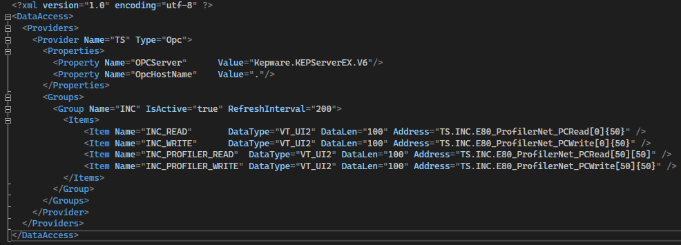
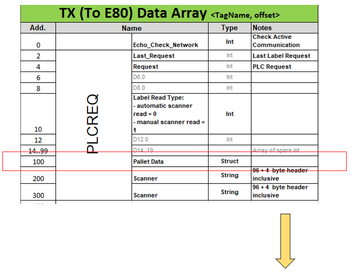
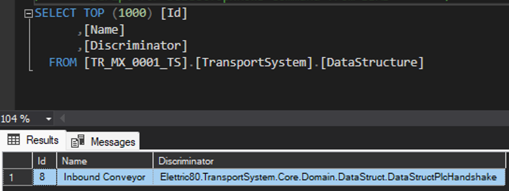
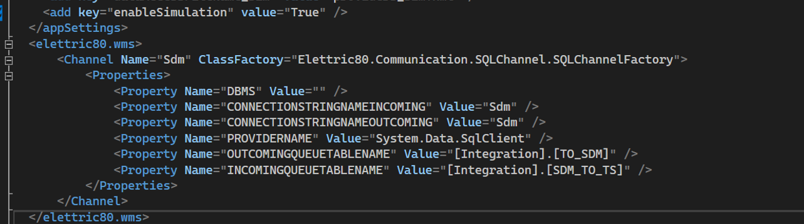
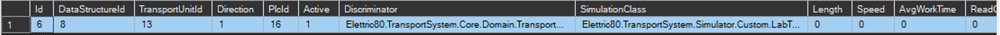
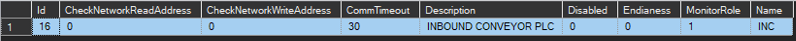
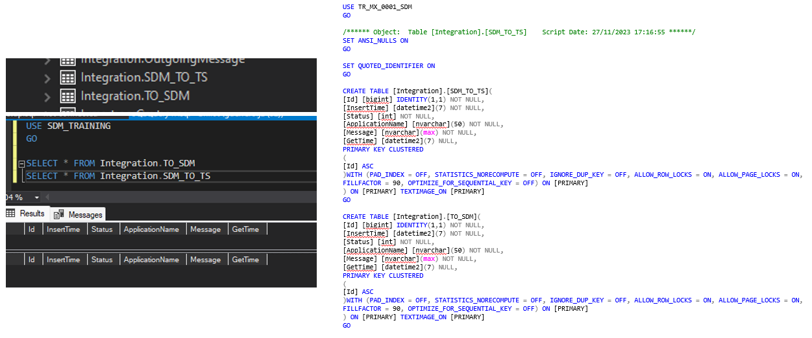

# Configuration Transport System
## Providers
In order to set the communication with the PLC’s we need to map the PLC’s connection properties through the **Providers.xml** file and configure the data exchange structures.

## Tracking Structure

`Elettric80.TransportSytem.Core.Structures TrackingStructure struct`

We might need to update the default tracking structure in the TS solution so we can read the data from the profiler as expected.

## Data Structure Configuration

In most cases instead of using the DataStructPlcHandshake default DataStructure implementation it is better to create a custom DataStructHandshake implementation which inherits from the DataStructure abstract class (`Elettric80.TransportSystem.Core.Domain.DataStruct`) to handle the PLC-PC read and write structures in the system.

Most of the implemented methods can be reused from the default implementation but there are few of these that it’s important to customize them:

`List< StockUnitInfo > GetStockUnitInfo()`
- It builds the pallet data (Stock Unit Info) with the read tracking structure. The returned value is later sent to SDM through the STKR message.

`byte[] SetTracking(StockUnitInfo t, Endianess e)`

- It builds the data array to write back to PLC with the StockUnitInfo items returned by SDM.

`bool SetReadTrackingStruct()`
- It parses the read tracking as the defined custom structure and set it in the class request property for later use.

Once defined it will be necessary to insert a record for the custom DataStruct into the TransportSystem.**DataStructures** table of the Transport System database and then be referenced in the TransportSystem.**TransportUnitPosition** table for the positions where we want transport system to use it when reading and evaluating the pallet data. The record should have the name and the discriminator value, the last one value must be **custom class name** with its namespace. For example for the default PLC DataStructure implementation:

`Elettric80.TransportSystem.Core.Domain.DataStruct.DataStructPlcHandshake`

## Connection Strings

We have to update in the App.config file the connection string value of the TS_Entities to point to the SQL Server Instance where we have the Transport System database deployed and update the Initial Catalog with the Transport System Database name.
Also it is necessary to update the connection string value of Sdm to point to the SQL Server Instance where we have the SDM database deployed and update the Initial Catalog value with the SDM Database name.

## Communication Channel

There are some options that we can use to communicate Transport System with WMS/SDM such as RabbitMQ Queues, Microsoft Queues, SQL Shared Tables.  We have to configure one of these in the **App.config** file of the solution with the Sdm channel name.

For the example we have the configuration for the SQL shared tables behavior in which we tell to Transport System the connection string and the Table (with its schema) where we want to send the incoming request to WMS/SDM and outgoing data response from WMS/ SDM.

## Database

### TransportSystem.TransportUnit
- **Enabled**. Flag to enable the transport unit.
- **Name** . Transport unit name. Ex. “Inbound conveyor”
- **Direction**. Determines the transport unit path direction. 1. Requesting, 2. Offering, 3. Both
- **Discriminator**. Specifies the transport unit class that implements the transport unit handling behavior. Ex. “Elettric80.TransportSystem.TransportUnitStandard”

Note: TransportUnit entity has more properties, here we just described the most relevant for a basic implementation. Remaining properties can be left as 0.

### TransportSystem.DataStructure

- **Name**. DataStructure name. Ex. “Inbound Conveyor”
- **Discriminator**. Defines the DataStruct class implementation that will handle the read and write structures. Ex. “Elettric80.TransportSystem.Core.Domain.DataStruct.DataStructPlcHandshake”

### TransportSystem.TransportUnitPosition 
 
- **DataStructureId**. Foreign key which defines the data structure record that will be used to handle the read/write operations for the TUP. 
- **TransportUnitId**. Foreign key which defines the relation of the position to a transport unit.
- **Direction**. It defines the action direction expected for the position. 1. Offering, 2. Requesting 
- **PlcId**. Foreign key which defines the relation of the position to a PLC
- **Active**. Flag to define the position as an active position, it says if the position requires PLC communication.
- **Discriminator**. Defines the TransportUnitRequest class that implements the request handling process. Ex. “Elettric80.TransportSystem.Core.Domain.TransportUnitPLCRequestHandshake”
- **SimulationClass**. Defines the custom simulation class that implements the simulation process. Can be null. 
- **SdmLocationName**. Defines the name for the location as expected in SDM for its validation.

Note: TransportUnitPosition entity has more properties, here we just described the most relevant for a basic implementation. Remaining properties can be left as 0.

### TransportSystem.OperationStation 

- **IsOfferingStation**. Flag that defines if the station is expected to be offering pallets to be picked up.
- **IsRequestingStation**. Flag that defines if the station is expected to be requesting pallets to be dropped off.
- **PlcId**. Foreign key which defines the relation of the Operation Station to a PLC
- **TransportUnitId**. Foreign key which defines the relation of the Operation Station to a Transport Unit.

Note: OperationStation entity has more properties, here we just described the most relevant for a basic implementation. Remaining properties can be left as 0.

### TransportSystem.Plc

- **CheckNetworkReadAddress**. Defines the starting offset for the echo check network value from PLC.
- **CheckNetworkWriteAddress**. Defines the starting offset for the check network value from PLC.
- **CommTimeout**. Defines the timeout for the communication with PLC.
- **Description**. PLC description.
- **Disabled**. Flag that defines if the PLC communication is disabled.
- **Endianess**. Defines the endianess for the data. 0. Little Endian, 1. Big Endian
- **MonitorRole**. It defines for the PLC the role it should have for the communication. 0. Passive, 1. Active, -1 None
- **Name**. Name of the PLC.

### TransportSystem.PlcItem

- **ItemName**. Defines the not only the item name but the address to find the item in the providers file. Name must be written following the structure: “ProviderName.GroupName.ItemName”
- **ItemType**. Define if the item is used to read/write data from/to provider. 0. Write, 1. Read, 2. ReadEvent, 3. WriteEvent
- **Offset**. Define the offset in bytes where to start reading or writing the data.
- **Lenght**. Define the length in bytes for the data to read/write.
- **PlcId**. Foreign key which defines the relation of the item to a PLC
- **TransportUnitPositionId**. Foreign key which defines the relation of the item to Transport Unit Position.

Note: PlcItem entity has more properties, here we just described the most relevant for a basic implementation. Remaining properties can be left as 0.

## WMS/SDM
### WMS Communication Channel

Just as described for the Transport System configuration, we have to configure for the WMS service the communication channel in order to find the incoming messages from TS and store the outgoing messages to TS. Also for this example we use the SQL Shared Tables channel configuration.

### SDM Shared Tables

We have to create the tables that will store the messages that WMS/SDM and Transport System will share between them.

### STKR Process Handler Procedure

In order to handle the processing for the STKR messages we have to create the usp_ProcessHandlerMessage_STKR Stored Procedure under the Handling schema and define the logic from the SDM side to validate the data and return the STKD message to Transport System.
 

### Registering Message Handler 

It is also required to register a message handler into the Integration.**MessageHandler** table of the SDM database in order to define the procedure that will process the message.

This configuration is important because it tells to SDM the channel name (InboundUrl and OutboundUrl) for the TS messages and also the tables where these messages are inserted(InboundEndpointName and OutboundEndPointName).

