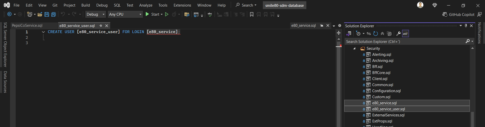
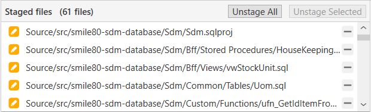

# Version Control Repository

## Commit
1. Open your repository and your branch
2. Click 'Clone' and copy https

3. Open source tree on local computer, click 'Clone' and paste copied url.

4. Create new branch

5. Open: "C:\Users\[yourUser].ELETTRIC80\OneDrive - Elettric 80\Devops\SDM\Source\src\smile80-sdm-database\smile80-sdm-database.sln" or where you saved the sln you want to check and open it on visual studio. 

6. Do a schema comparison, because we want to compare the procedures. Do it from database to project sdm. 

7. Click on compare then check if needed, then update. Make sure to compare again and all changes where updated 

8. Erase the files

9. On source tree stage all changes (git add) 

10. Then click 'COMMIT' to commit the changes, after that click 'PUSH' to the branch you created. Your changes are now in your branch 

## Merge
1. To pass those changes to the dev branch: open devops and go to the repository 

2. Click on pull requests, then click "new pull request" 

3. Make sure from your branch to dev 

4. Check pull was successful, you can check the progress in the pipeline. It will show active on the pull requests tab. 

5. Click on "Complete" to finish the pull request 

6. Make sure the pull request now says completed 
