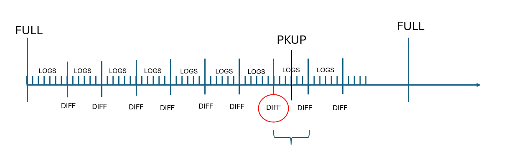
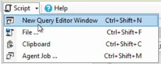

# Backup
## Create a Backup

For SDM there is a procedure called 

**Mainteance.usp_CreateDatabaseBackupJobs:** this creates the jobs to call the **Maintenance.usp_ExecuteDatabseBackup_Job:** this saves the backups. 
There is a backup folder located on where you state on the ApplicationSettings table. 

You need to have this in order for the backups to work: 
1. SQL Server Agent 
2. Jobs 
3. SDM_DBBackup 

 ## Primary and secondary backups 

 Primary and secondary backups 

We need to know what machine we are using in order to do the backup for that machine, because if not we get an error. 

 

We have 2 machines exactly the same,  

For the LgvM to know to which IP address it should connect to, we have a virtual IP address, and it is just redirected to the machine that is working. 

If you want to restore something: 

1. Full backup every day 
2. Diff backup every hour 
3. Log backup every 10 min 

Like you did a pkup and it supposedly sent it somewhere, but we want to check more. 

## To restore the backup 

1. Open SQL 
2. Right click on the database you want to restore, click restore 

3. Select the .bak on the folder you saved them 

4. Select  the timeline, and select the time where you want to restore it to.  

(Generate the script -> you can add the miliseconds there)

If you get a warning then deselect "Take tail-log…" 

