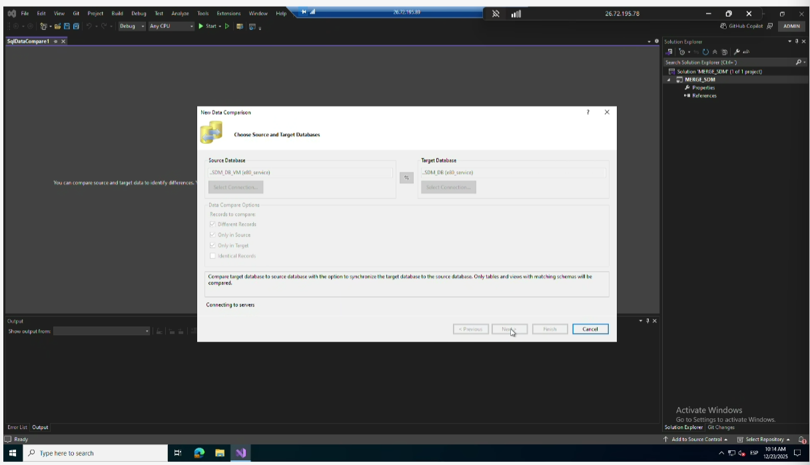

# Schema & Data Compare

## 📊 Data Compare
In **Visual Studio**, the *Data Compare* feature in **SQL Server Data Tools (SSDT)** allows you to compare and synchronize data (rows and values) between two SQL Server databases.  
It highlights differences and can generate scripts to update the target database.

### Recommended Steps
1. Compare **only the tables** (views are not relevant since they just join tables).  
2. In the filter, select these three options:  
   - **Different Records**  
   - **Only in source**  
   - **Only in target**  
3. **Import only configuration data.**  
   - Historical data **must not be imported**.  
   - The table **IDCONDITIONLOCATION** must not be imported; simply re‑trigger to regenerate it.

---

## 🏗️ Schema Compare
The *Schema Compare* tool is used to synchronize the definition of objects (tables, procedures, functions, etc.) between a database and a SQL Server project.

### Recommended Steps
1. Create a **new project** in Visual Studio.  
2. Select **SQL Server Database Project**.  
3. In the solution, right‑click the project name (e.g., `PEPSI_...`) → **Schema Compare**.  
4. Configure:  
   - **From DB (PEPSI SDM) → To Solution** → Compare → Update.  
5. In **References**, add database references to `master` and `msdb`.  
6. Modify objects as needed (e.g., `StockUnitInfo`).  
7. Finally:  
   - **From Solution → To DB** → Compare → Update.  

---

## 🔄 Data Compare (with backups)
This workflow is used to compare data between environments (e.g., VM vs. production).

### Recommended Steps
1. Restore **backups** (SDM and LGVM from the E80 test server to Pepsi).  
2. Create a **new SQL Server project** in Visual Studio.  
3. Run **Data Compare** between the VM database and the production database.  
4. Select **SQL Data Comparison**.  
5. Compare VM vs. production again.  
6. In the results, select:  
   - **Different Records**  
   - **Only in source**  
   - **Only in target**  
7. Finish the process.  
   - **Do not run Update** (this is for analysis only).  

---

## ✅ Best Practices
- Always validate changes in a test environment before applying them to production.  
- Document differences found and objects modified.  
- Avoid importing historical data or tables that are automatically regenerated.  
- Keep references (`master`, `msdb`) updated to prevent compilation errors in the project.  

---

## 📌 Schema Compare vs. Data Compare

| Feature              | Schema Compare                                                                 | Data Compare                                                                 |
|----------------------|---------------------------------------------------------------------------------|-------------------------------------------------------------------------------|
| **Purpose**          | Synchronize database objects (tables, views, procedures, functions, etc.)       | Synchronize data (rows and values) between databases                          |
| **Scope**            | Database structure / schema                                                     | Database content / records                                                    |
| **Use Case**         | Align project schema with database or migrate schema changes                    | Identify and align differences in configuration data between environments     |
| **Typical Workflow** | From DB → To Project → Update, then Project → To DB → Update                    | Compare source vs. target, select differences, import only configuration data |
| **Update Behavior**  | Updates schema objects in target (tables, procedures, etc.)                     | Updates data in target (rows/values) — but often used for analysis only       |
| **Caution**          | Ensure references (`master`, `msdb`) are added to avoid errors                  | Do not import historical data or auto‑generated tables (e.g., IDCONDITIONLOCATION) |
