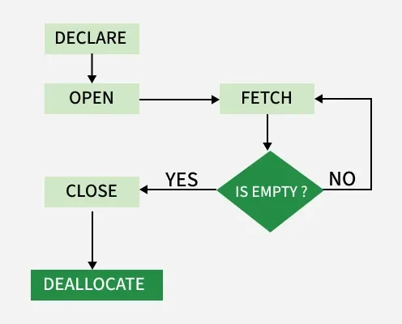

A cursor in SQL is a database object used to process data one row at a time, useful when row-by-row iterative handling is needed instead of bulk processing. It temporarily stores data for operations like SELECT, UPDATE, or DELETE.



Here is a complete example of declaring, opening, fetching, closing, and deallocating a cursor:
```SQL
DECLARE emp_cursor CURSOR FOR SELECT Name, Salary FROM Employees;

BEGIN
	-- Open Cursor
	OPEN emp_cursor;
	
	-- Fetch rows from cursor
	FETCH NEXT FROM emp_cursor INTO @Name, @Salary;
	WHILE @@FETCH_STATUS = 0
	BEGIN
		PRINT 'Name: ' + @Name, ', Salary: ' + CAST(@Salary AS VARCHAR);
		FETCH NEXT FROM emp_cursor INTO @Name, @Salary;
	END;
	
	-- Close Cursor
	CLOSE emp_cursor;
	
	-- Deallocate Cursor
	DEALLOCATE emp_cursor;
END;
```