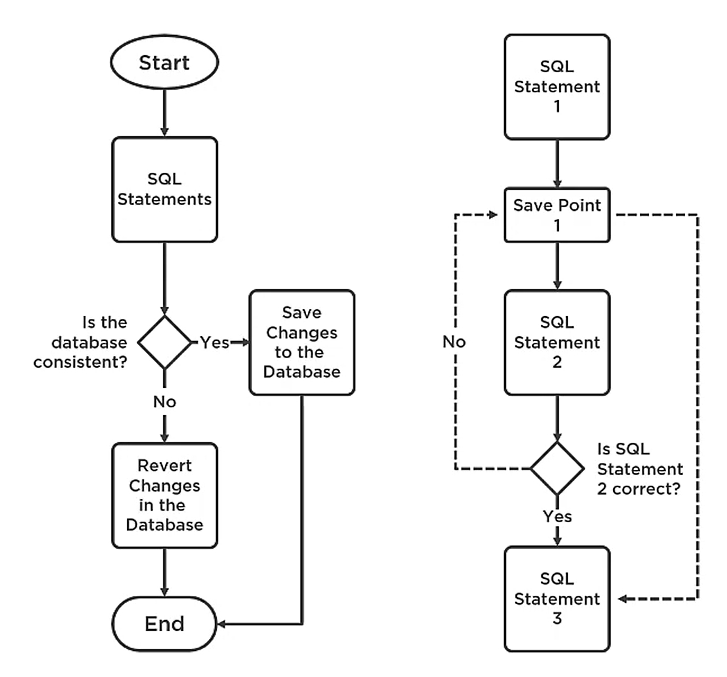

A transaction is a set of statements preformed so that they are all guaranteed to succeed or fail as a single unit.
### Transaction Properties (ACID)
- Atomicity: All or nothing transactions
- Consistency: Valid State maintenance
- Isolation: Transactions do not affect each other
- Durability: Permanent changes after commitment
### Transaction Modes
- Auto commit Transactions: Each individual statement is a transaction
- Explicit Transaction: Each transaction is explicitly started and completed
- Implicit Transaction: Transaction starts automatically after each commit
